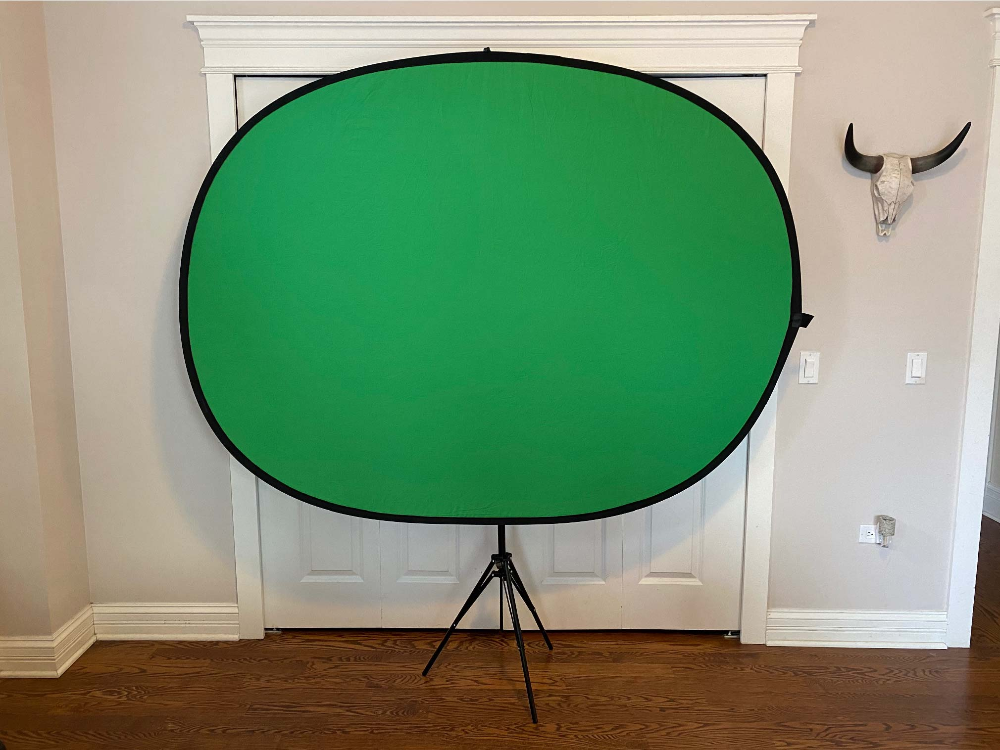
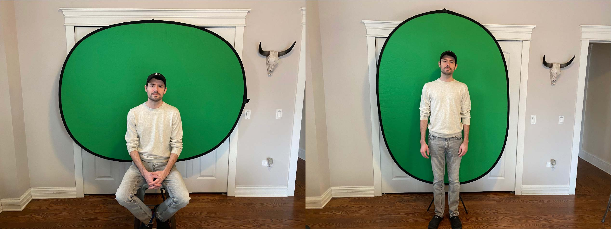
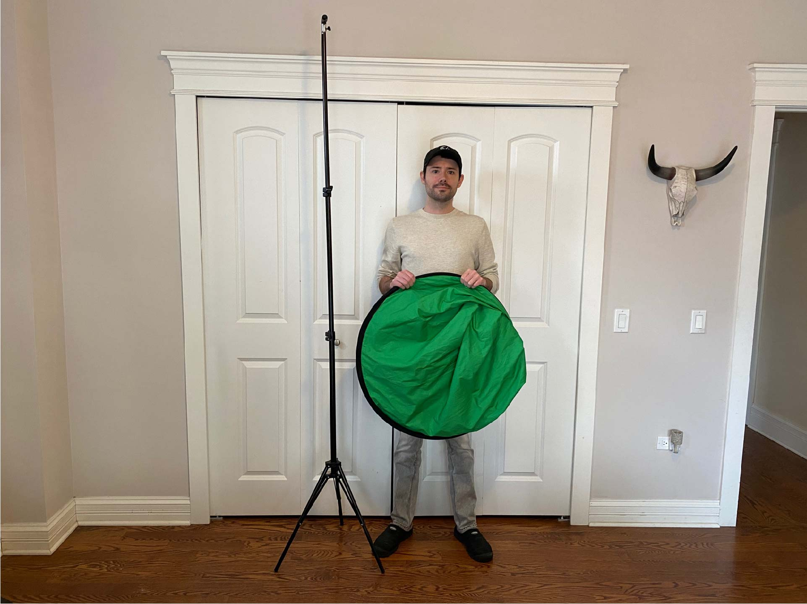

Hello! Today I want to share a quick tutorial on how to use a green screen in [Adobe Premiere Pro](https://www.adobe.com/products/premiere.html?sdid=KKQOM&mv=search&kw=test&ef_id=CjwKCAiAjp6BBhAIEiwAkO9Wuio80LqbtnaqDCEclArcjpHpSpbm5vfJjf8NyvEIU3mf2OReKuOx9RoCUt4QAvD_BwE:G:s&s_kwcid=AL!3085!3!469198202114!e!!g!!adobe%20premiere%20pro&gclid=CjwKCAiAjp6BBhAIEiwAkO9Wuio80LqbtnaqDCEclArcjpHpSpbm5vfJjf8NyvEIU3mf2OReKuOx9RoCUt4QAvD_BwE){target="_blank"}! Premiere Pro is a video editor in the Adobe Creative Cloud suite that's got a ton of great features that make movie making a breeze! I wanted to try out using a green screen because I'm working on a video of my PhD defense. Due to COVID I can't defend in person, so I thought I'd try to have some fun with special effects! First I'll go through the equipment I used and then I'll show you how to replace your green screen background in Adobe.

## Green Screen 

This is a green screen I bought on [Amazon](https://www.amazon.com/gp/product/B08KDFXBXK/ref=ppx_yo_dt_b_asin_image_o00_s00?ie=UTF8&psc=1){target="_blank"}. I chose this green screen because I wanted to be able to use it anywhere in my apartment, sitting or standing.

Green screen from Amazon.

The dimensions are 5'x7' and you can hang it either landscape or portrait orientation on a telescoping tripod. The tripod height is adjustable and easy to set up.

Landscape and portrait orientations with Chris for scale.

The other thing I love about this green screen is that you can fold it up so it doesn't take up much space. It's double-sided with green on one side and blue on the other, and it's very lightweight.

The folded up green screen fits in my closet.

## Ring Light

I also bought this ring light on [Amazon](https://www.amazon.com/gp/product/B08CM3B44L/ref=ppx_yo_dt_b_asin_title_o01_s00?ie=UTF8&psc=1){target="_blank"} because the green screen works best when your background has no shadows. The ring light is on a telescoping tripod so the height is adjustable and can be used sitting or standing.

Ring light with Chris for scale.

The ring light has controls for three different light colors from cool to warm and brightness levels. There's also a bluetooth controller that you can use for the shutter on your phone camera if you want to take selfies!

Ring light cool and warm colors, light controller, and bluetooth shutter controller.

## Adobe Premiere Pro 

And now for my super quick green screen tutorial in Premiere Pro! Check out the video below to see how I set the green screen background to transparent and layered my videos for a cool background effect. I'm a noob myself so if you have tips please share them in the comments section on this page below!

<iframe width="100%" height="400" src="https://www.youtube.com/embed/ULF2nGJXhHk" frameborder="0" allow="accelerometer; autoplay; clipboard-write; encrypted-media; gyroscope; picture-in-picture" allowfullscreen></iframe>

I hope you enjoyed this tutorial, feel free to comment below with any comments/questions! `r emo::ji("sunglasses")`

