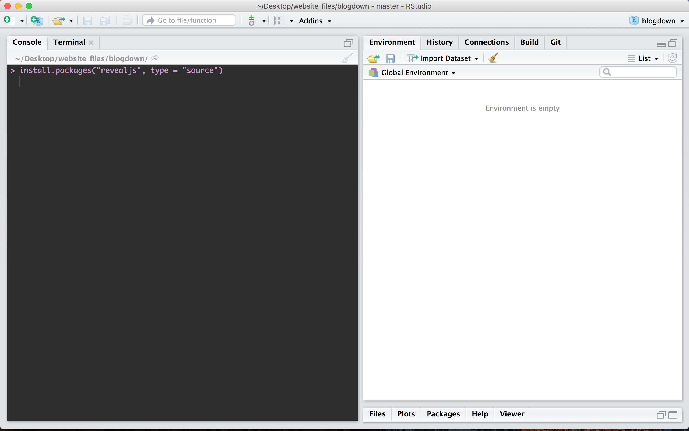
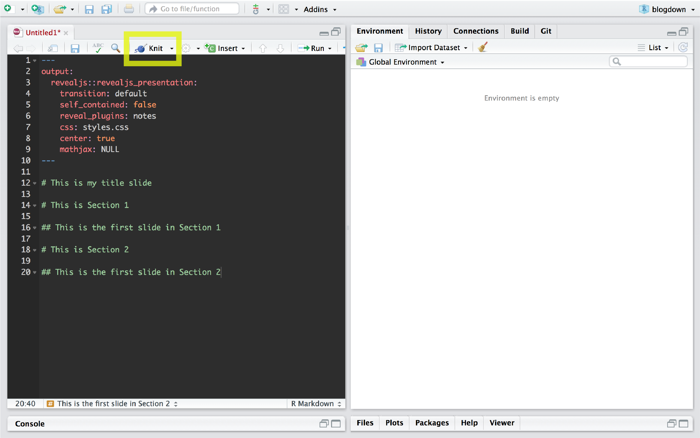
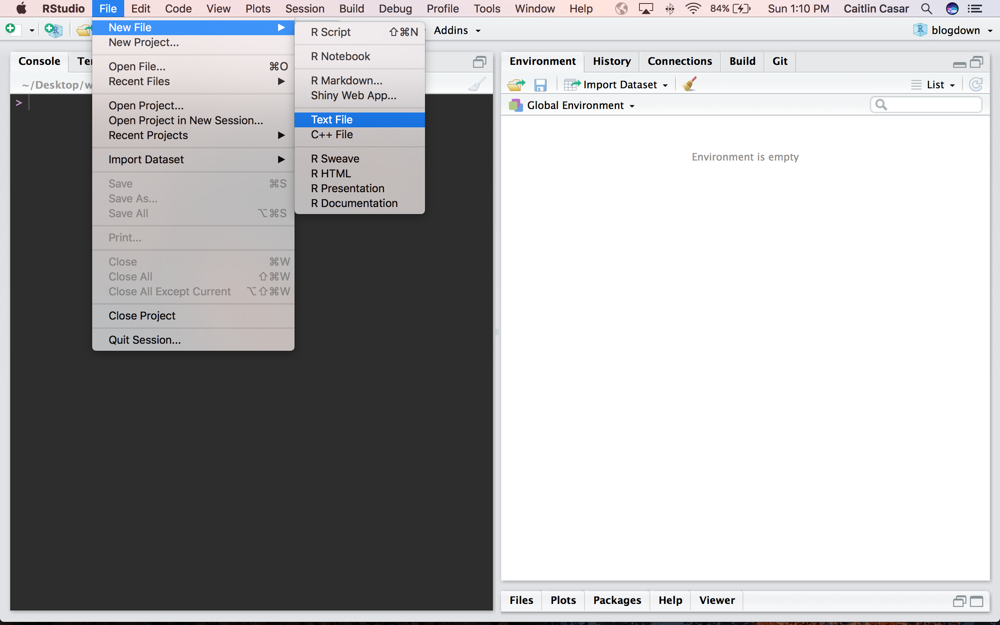

<p>Today I'll show you how to spice up your presentations with [revealJS](https://github.com/rstudio/revealjs){target="_blank"} in R. This is an HTML presentation framework that allows you to share your slides on the web, add custom animations, embed websites into your slides, and more! Here's an example of a presentation I made for my 2020 Spring Committee Meeting:</p>

<iframe src="SpringCommitteeMeeting2020/revealjs.html" width="100%" height="500" style="border: none;"></iframe> 

<p>This presentation was a lot of fun to make! Here I'll show you the basics, then I'll give examples of more advanced stuff you can do.</p>

1. <p>First, we need to get set up to use revealjs in R. Open RStudio and run the following in your console:</p>

```{r, eval=F}
install.packages("revealjs", type = "source")
```



2. <p>Next, open up a new R markdown document.</p>


3. <p>Select the HTML output in the pop-up window and give your document a title.</p>


4. <p>Then modify your header content. To make my slides in the example above, I used this header:</p>

```{r, eval=F}
---
output: 
  revealjs::revealjs_presentation:
    transition: default
    self_contained: false
    reveal_plugins: notes
    css: styles.css
    center: true
    mathjax: NULL
---
```


<p>Here's a breakdown of those parameters:</p>
- <p><strong>Output</strong> indicates that you want a revealjs output.</p>
- <p><strong>Transition</strong> sets your slide transitions. You can choose from "default", "fade", "slide", "convex", "concave", "zoom" or "none".</p>
- <p><strong>Self contained</strong> determines whether dependencies are external or internal. To use plugins this has to be set to false.</p>
- <p><strong>Reveal plugins</strong> enable plugins including notes, zoom, search, and chalkboard. The notes plugin functions much like presenter mode in Powerpoint.</p>
- <p><strong>CSS</strong> is your custom styles CSS (cascading style sheet) file. This allows you to add styling to HTML elements, such as font color, add animations, and more.</p>
- <p><strong>Center</strong> sets all of your slides to center text alignment. You can set the alignment on individual slides as well.</p>
- <p><strong>Mathjax</strong> enables rendering of LaTeX and MathML equations including special characters like greek symbols. Options include default, local, and NULL.</p>

5. Now, lets add some slides!:

```{r, eval = F}
---
output: 
  revealjs::revealjs_presentation:
    transition: default
    self_contained: false
    reveal_plugins: notes
    css: styles.css
    center: true
    mathjax: NULL
---

# This is my title slide

# This is Section 1

## This is the first slide in Section 1

# This is Section 2

## This is the first slide in Section 2
```

<p>Once your slides are ready, click the Knit button to build the html output and preview your slides!</p>



<p>The code above produces the following slides:</p>

<iframe src="example_slides/example1.html" width="100%" height="500" style="border: none;"></iframe> 

6. <p>Let's add some style to the slides. We can add a background color, background image, or embed an html file as the background! Be aware of potential securtiy issues when embedding an external website - you should only do this if you trust the site! Here, I added different types of backgrounds on each slide, including image, video, html, and color:</p>

```{r, eval = F}
---
output: 
  revealjs::revealjs_presentation:
    transition: default
    self_contained: false
    reveal_plugins: notes
    css: styles.css
    center: true
    mathjax: NULL
---

# {data-background="https://images.pexels.com/photos/949587/pexels-photo-949587.jpeg?auto=compress&cs=tinysrgb&dpr=2&w=500"}

<h1 style="color: #fff">Caitlin's Presentation</h1>

# {data-background=#262626}

<h1 style="color: #fff">Check out my website</h1>

## {data-background-iframe="https://www.caitlincasar.com"}

# Check out this video I made 

## 
<iframe width="100%" height="500" src="https://www.youtube.com/embed/FZ66_XqZZhg" frameborder="0" allow="accelerometer; autoplay; encrypted-media; gyroscope; picture-in-picture" allowfullscreen></iframe>

## {data-background-video="AreWeAlone_Corrected.mp4"}
```

<iframe src="example_slides/example2.html" width="100%" height="500" style="border: none;"></iframe> 

<p><strong>Note:</strong> This example doesn't include the last slide in the example Rmarkdown above due to file size limits on Github where I host my content.</p>

7. <p>Let's add some fun styling with CSS! Open a new text file and name it styles.css. Save this in the same directory as your Rmarkdown file.<p>



<p>Add some styling to the h1 element - these are the headers in your slide. Here, I'm changing the font color and adding a cool animation.</p>

```{css, eval=F}
.present .tracking-in-expand {
	-webkit-animation: tracking-in-expand 0.7s cubic-bezier(0.215, 0.610, 0.355, 1.000) both;
	        animation: tracking-in-expand 0.7s cubic-bezier(0.215, 0.610, 0.355, 1.000) both;
}
@-webkit-keyframes tracking-in-expand {
  0% {
    letter-spacing: -0.5em;
    opacity: 0;
  }
  40% {
    opacity: 0.6;
  }
  100% {
    opacity: 1;
  }
}
@keyframes tracking-in-expand {
  0% {
    letter-spacing: -0.5em;
    opacity: 0;
  }
  40% {
    opacity: 0.6;
  }
  100% {
    opacity: 1;
  }
}

h1 {
	color: #262626;
	-webkit-animation: tracking-in-expand 0.7s cubic-bezier(0.215, 0.610, 0.355, 1.000) infinite both;
	        animation: tracking-in-expand 0.7s cubic-bezier(0.215, 0.610, 0.355, 1.000) infinite both;
}
```


<p>This is the Rmarkdown content I used to produce the slide below:</p>

```{r, eval=F}
---
output: 
  revealjs::revealjs_presentation:
    transition: default
    self_contained: false
    reveal_plugins: notes
    css: styles.css
    center: true
    mathjax: NULL
---

# {data-background=#262626}

<h1 style="color: #fff">Caitlin's Presentation</h1>

```

<iframe src="example_slides/example3/example3.html" width="100%" height="500" style="border: none;"></iframe> 


<p>Here's an example where I used both custom CSS and a custom html header:</p>


```{css, eval=F}
@-webkit-keyframes color-change-5x {
  0% {
    color: #19dcea;
  }
  25% {
    color: #b22cff;
  }
  50% {
    color: #ea2222;
  }
  75% {
    color: #f5be10;
  }
  100% {
    color: #3bd80d;
  }
}
@keyframes color-change-5x {
  0% {
    color: #19dcea;
  }
  25% {
    color: #b22cff;
  }
  50% {
    color: #ea2222;
  }
  75% {
    color: #f5be10;
  }
  100% {
    color: #3bd80d;
  }
}


#title h1 {
	font-size: 1.50em;
	color: #ffff00;
	font-family: 'Roboto', sans-serif !important;
		-webkit-animation: color-change-5x 8s linear infinite alternate both;
	        animation: color-change-5x 8s linear infinite alternate both;
}		

.color-change-5x-background {
	-webkit-animation: color-change-5x-background 2s linear infinite alternate both;
	        animation: color-change-5x-background 2s linear infinite alternate both;
}


@-webkit-keyframes color-change-5x-background {
  0% {
    background: #19dcea;
  }
  25% {
    background: #b22cff;
  }
  50% {
    background: #ea2222;
  }
  75% {
    background: #f5be10;
  }
  100% {
    background: #3bd80d;
  }
}
@keyframes color-change-5x-background {
  0% {
    background: #19dcea;
  }
  25% {
    background: #b22cff;
  }
  50% {
    background: #ea2222;
  }
  75% {
    background: #f5be10;
  }
  100% {
    background: #3bd80d;
  }
}
```


<p>I added custom font from Google fonts by creating a new text file called header.html and adding this to the file:</p>

```{r, eval=F}
<link href="https://fonts.googleapis.com/css2?family=Roboto:wght@900&display=swap" rel="stylesheet">
```

<p>This is the Rmarkdown file I used to produce the slides below:</p> 

```{r, eval=F}
---
output: 
  revealjs::revealjs_presentation:
    transition: default
    self_contained: false
    reveal_plugins: notes
    css: styles.css
    in_header: header.html
    center: true
    mathjax: NULL
---

# {#title data-background=#262626}

<h1 style="color: #fff">Caitlin's Presentation</h1>

# Rainbow background! {.color-change-5x-background}
```

<iframe src="example_slides/example4/example4.html" width="100%" height="500" style="border: none;"></iframe> 


<p>As you can see, there's a ton of cool stuff you can do with revealjs! Check out the [official documentation](https://github.com/rstudio/revealjs){target="_blank"} for more information, and check out [this guide](https://github.com/rstudio/revealjs){target="_blank"} for more info on Rmarkdown.</p>

<p>Congrats on making awesome slides in revealjs! `r emo::ji("sunglasses")` Feel free to comment below with any comments/questions!</p>


