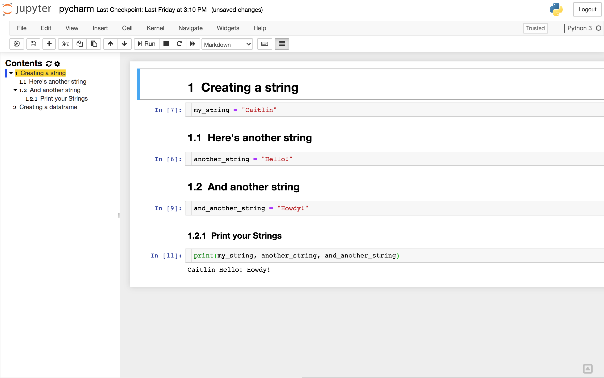
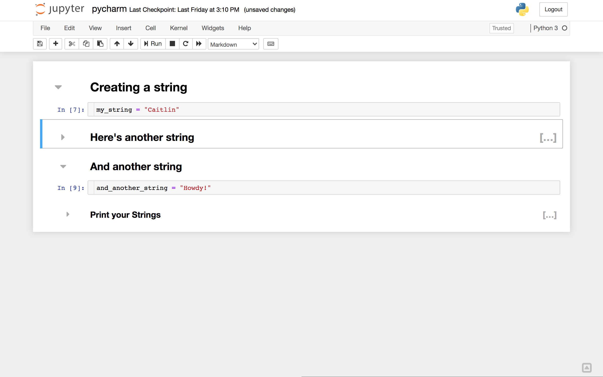

Today I'm sharing my top 10 list of cool things you can do in [Jupyter](https://jupyter.org/){target="_blank"} notebooks! 

## 1. Jupyter notebook extensions

<p>You can add functionality to your Jupyter notebook with [Jupyter Notebook Extensions](https://github.com/ipython-contrib/jupyter_contrib_nbextensions){target="_blank"}! To install Jupyter Notebook Extensions, run the following in your terminal:</p>

```{bash, eval=F}
pip install jupyter_contrib_nbextensions
jupyter contrib nbextension install --user
jupyter nbextensions_configurator enable --user
```

<p>To view your extensions, launch a Jupyter notebook in your browser and click on the Nbextensions tab in your tree view. You can also type the url into your browser, as in 'http://localhost:8899/tree#nbextensions_configurator'.</p>


<p><strong>Note:</strong> Your extensions may appear grayed out and indicate a compatability issue with newest version of Jupyter Notebook as referenced on StackOverflow [here](https://stackoverflow.com/questions/58146683/all-jupyter-contrib-nbextensions-are-marked-as-possibly-incompatible){target="_blank"}. To use extensions, uncheck the box next to 'disable configuration for nbextensions without explicit compatibility (they may break your notebook environment, but can be useful to show for nbextension development)'.</p>

<p>Try turning on the [Table of Contents (2)](https://jupyter-contrib-nbextensions.readthedocs.io/en/latest/nbextensions/toc2/README.html#){target="_blank"} extension. This is a nice tool for organizing your notebook in a way that can be easily navigated via the TOC sidebar. Here I created a series of markdown cells and code cells with different header hierarchy which you can see is reflected in the TOC.</p>



<p>Another cool extension is [Collapsible Headings](https://jupyter-contrib-nbextensions.readthedocs.io/en/latest/nbextensions/collapsible_headings/readme.html){target="_blank"}. In my example, you can see there are now gray arrows next to each cell, and I've collapsed the cells with headers 'Here's another string', and 'Print your Strings' so that the contents below each are now hidden.</p>



## 2. Plotly for interactive plots

<p>A great tool for plotting is Plotly, which creates interactive figures that can streamline your data exploration.</p>

## 3. Magics 

[Magics](https://ipython.readthedocs.io/en/stable/interactive/magics.html){target="_blank"}

## 4. Widgets

<p>[Widgets](https://ipywidgets.readthedocs.io/en/latest/examples/Widget%20Basics.html){target="_blank"} are eventful Python objects like sliders and drowdown menus that allow you to create a GUI in your notebook. Run this in your teminal to install the widgets extension:</p>

```{bash, eval=F}
pip install ipywidgets
jupyter nbextension enable --py widgetsnbextension
```

<p>You can see the full list of available widgets [here](https://ipywidgets.readthedocs.io/en/latest/examples/Widget%20List.html){target="_blank"}, which includes buttons, sliders, dropdowns, and more! One that I think is particulary cool is the widget for HTML. I use iframes pretty frequently - check out how I embedded an iframe in my notebook which allows me to navigate my website inside the iframe:</p>


## 5. nbconvert 
<p>Your workflow might include Jupyter notebooks for documentation, and a python script for batch jobs. You can easily convert your Jupyter notebook to a Python script or other formats with [nbconvert](https://nbconvert.readthedocs.io/en/latest/){target="_blank"}. To do this from your Jupyter notebook, run the following in a code cell:</p>

```{bash, eval=F}
!jupyter nbconvert --to python 'example.ipynb' --stdout
```

<p>When I run this in my notebook in the nbextensions example above, I get the following output:</p>

```{markdown, eval=F}
[NbConvertApp] Converting notebook pycharm.ipynb to python
#!/usr/bin/env python
# coding: utf-8

# # Creating a string
# 
# 

# In[7]:


my_string = "Caitlin"


# ## Here's another string

# In[6]:


another_string = "Hello!"


# ## And another string

# In[9]:


and_another_string = "Howdy!"


# ### Print your Strings 

# In[11]:


print(my_string, another_string, and_another_string)
```

<p>You can also convert your notebook to a script without the markdown cells. For more info, see the documentation [here](https://nbconvert.readthedocs.io/en/latest/customizing.html#Converting-a-notebook-to-an-(I)Python-script-and-printing-to-stdout){target="_blank"}.</p>

## 6. Color Themes

[jupyter-themes](https://github.com/dunovank/jupyter-themes){target="_blank"}

[Dark Reader](https://darkreader.org/){target="_blank"}

## 7. Plotly for interactive plots

## 8. Plotly for interactive plots

## 9. Plotly for interactive plots

## 10. Plotly for interactive plots
